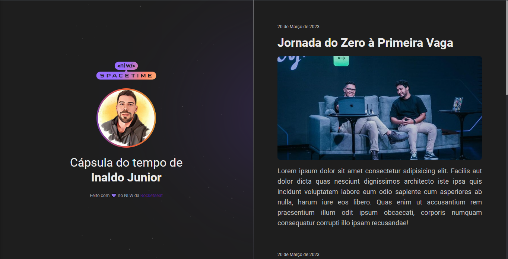

# NLW
Eventos Rocketseat

    

 

## 🖥💻 Projeto
NLW - Spacetime é um projeto Web Responsivo de uma cápsula do tempo para exibir memórias em uma linha do tempo.

## 🚀 Tecnologias

 
 
 
 

## 🏷 Layout
Você pode visualizar o layout do projeto através desse [link](https://www.figma.com/file/HDs0N2HewlfigRKY8bNx57/C%C3%A1psula-do-tempo-%E2%80%A2-Trilha-Explorer-(Community)-(Copy)?type=design&node-id=352%3A8&t=78oNvS8vvCzTSMNl-1).
É necessário ter uma conta no [Figma](https://www.figma.com)
